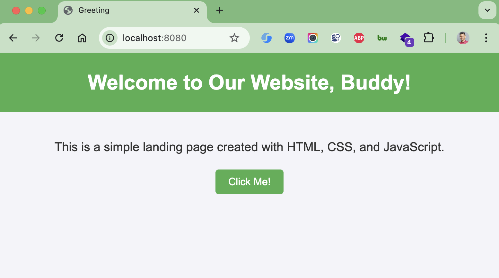

# go-simple

### Things to do list:

1. Clone this repository: `git clone https://github.com/hendisantika/go-simple.git`
2. Navigate to the folder: `cd go-simple`
3. Run the application: `go run main.go`
4. Open your favorite browser: `http://localhost:8080/`

### Image Screen shot

Home Page

